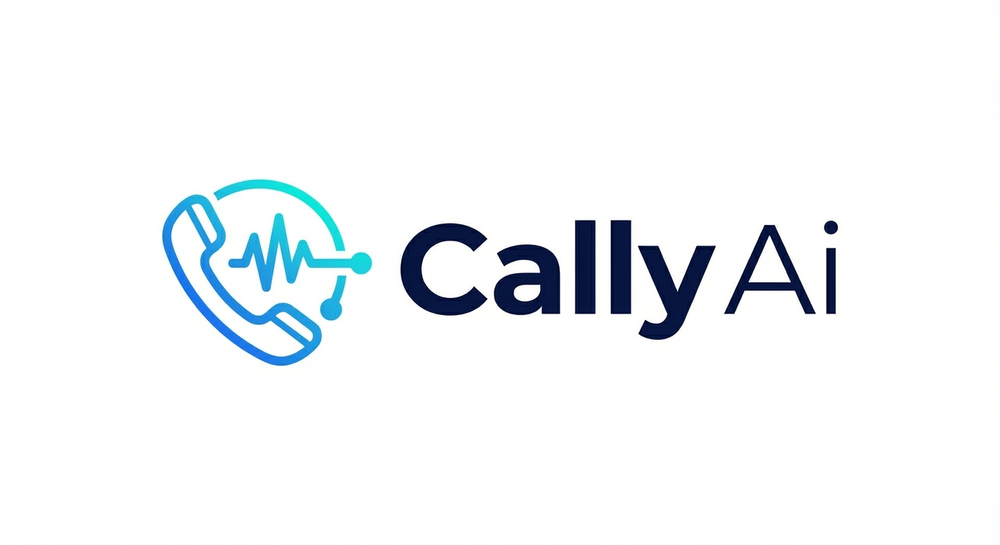

# Callyy - AI Voice Agent Dashboard

Callyy is a comprehensive dashboard for managing AI-powered voice agents. Built with React, TypeScript, and Supabase.



## 🚀 Features

- **AI Voice Assistants** - Create and manage AI-powered voice agents
- **Voice Library** - Browse and select from multiple voice providers (ElevenLabs, PlayHT, etc.)
- **Phone Numbers** - Manage inbound/outbound phone numbers with Twilio/VAPI integration
- **Call Logs** - Track and analyze all voice interactions
- **Customer Memory** - AI-powered customer insights and conversation history
- **Knowledge Base** - Upload and manage documents for your AI assistants
- **Team Management** - Invite members and manage organization settings
- **Referral Program** - Built-in referral system with rewards

## 📁 Project Structure

```
├── frontend/          # React + Vite frontend application
├── backend/           # Node.js/Express backend server
├── docs/              # Documentation and setup guides
│   └── marketing/     # Marketing materials and playbooks
├── assets/            # Static assets (fonts, etc.)
└── .github/           # GitHub configuration
```

## 🛠️ Tech Stack

### Frontend
- React 19 with TypeScript
- Vite for build tooling
- Tailwind CSS (CDN-based)
- React Router v7
- Lucide React icons

### Backend
- Node.js with Express
- Supabase (PostgreSQL + Auth)
- Row Level Security (RLS)

### Integrations
- VAPI for voice AI
- Twilio for phone numbers
- ElevenLabs, PlayHT for voice synthesis

## 🏃‍♂️ Quick Start

### Prerequisites
- Node.js 18+
- npm or yarn
- Supabase account

### Frontend Setup

```bash
cd frontend
npm install
cp .env.example .env.local  # Add your Supabase credentials
npm run dev
```

### Backend Setup

```bash
cd backend
npm install
node index.js
```

### Environment Variables

**Frontend** (`frontend/.env.local`):
```
VITE_SUPABASE_URL=your_supabase_url
VITE_SUPABASE_ANON_KEY=your_supabase_anon_key
```

## 📚 Documentation

All documentation is in the `docs/` folder:

- [Database Setup](docs/README_DATABASE_SETUP.md)
- [Auth Setup](docs/AUTH_SETUP_COMPLETE.md)
- [Voice Library](docs/VOICE_LIBRARY_SETUP.md)
- [Phone Numbers](docs/PHONE_NUMBERS_SETUP.md)
- [Customer Memory System](docs/CUSTOMER_MEMORY_SYSTEM.md)
- [Knowledge Base](docs/KNOWLEDGE_BASE_SCHEMA_SETUP.md)

## 🗄️ Database Migrations

Migrations are located in `backend/supabase/migrations/`. Apply them in order via the Supabase SQL Editor.

## 📄 License

Private - All rights reserved.

## 🤝 Contributing

This is a private repository. Please contact the team for contribution guidelines.
